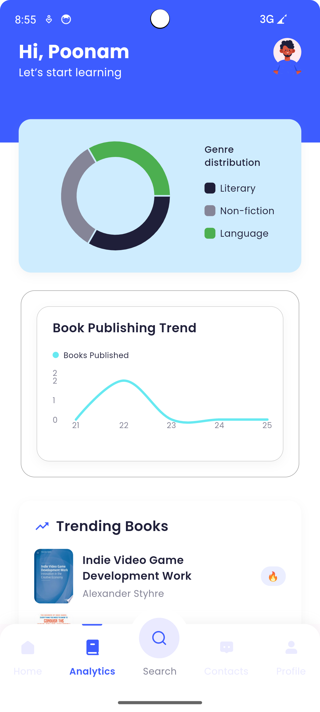
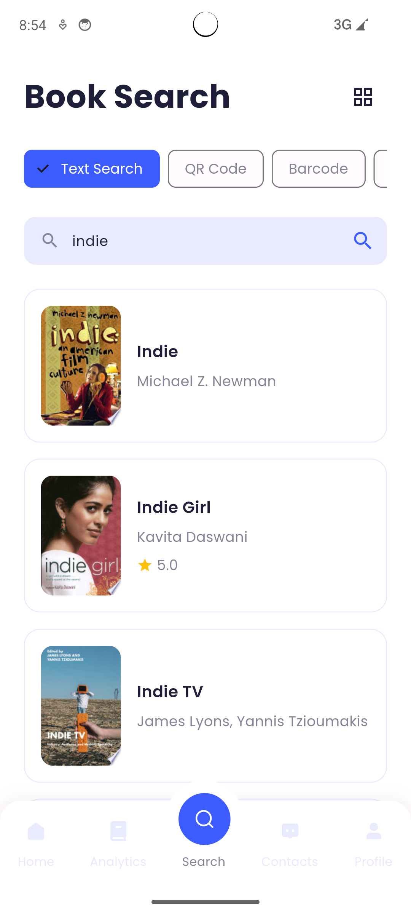
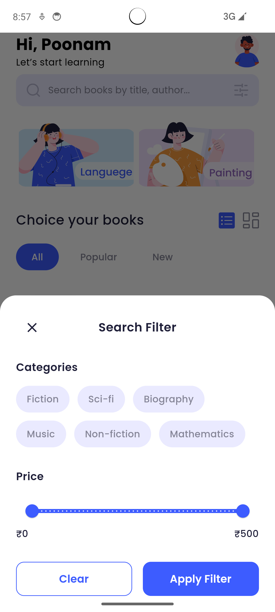
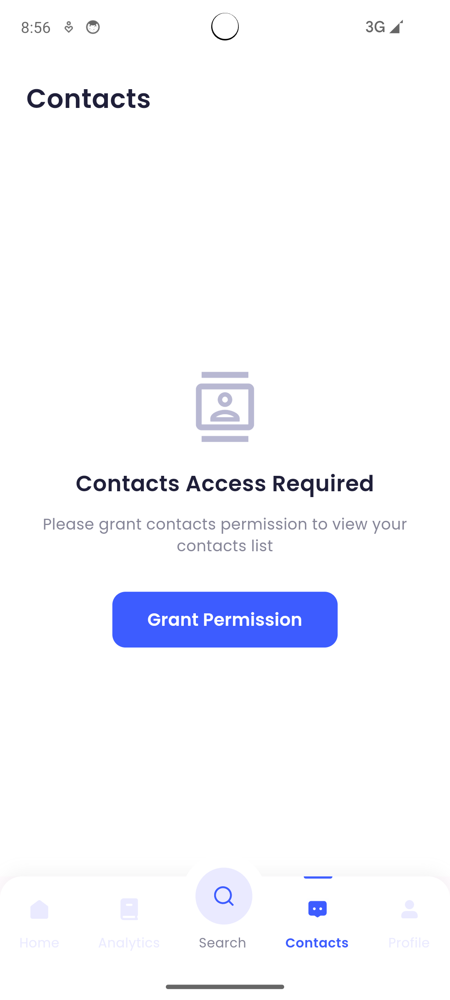
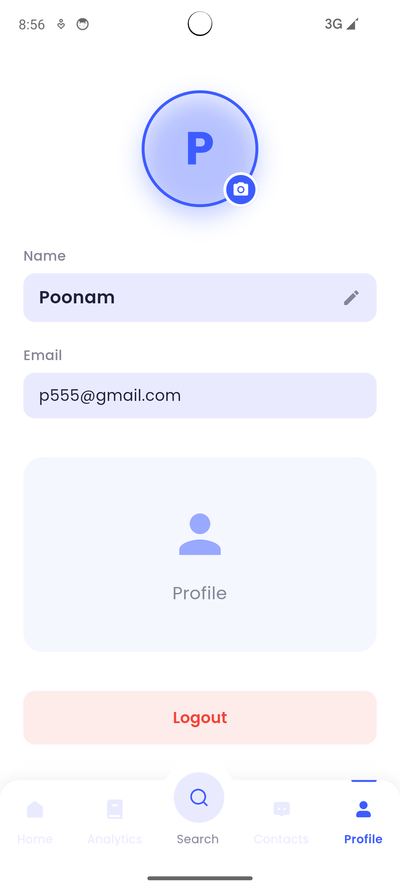
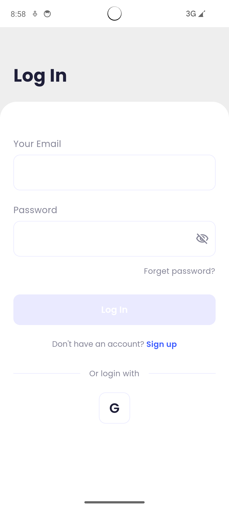
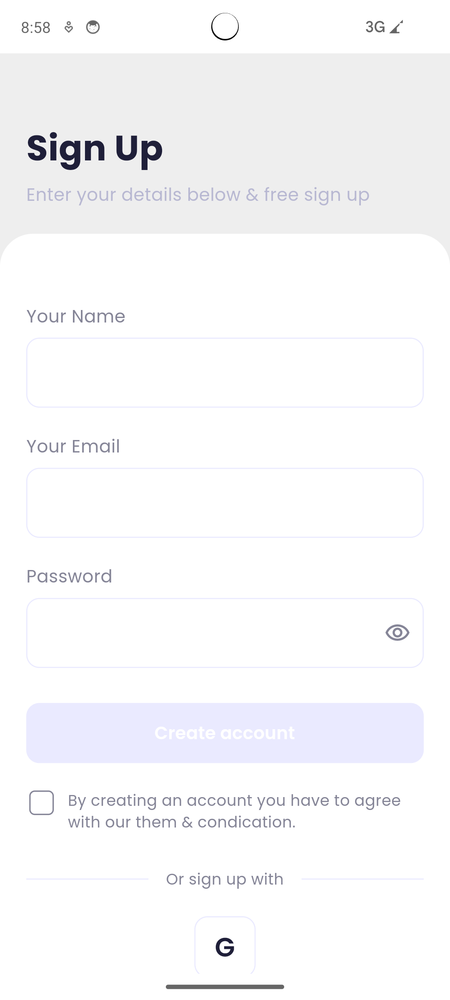

# 📚 Readify — Books Discovery App

A Flutter application with multi-modal book search, analytics, AI-powered features, and real-time updates.

---

## 📸 Screenshots

### 🏠 Home Tab


- Personalized greeting with user name
- Search bar with filters
- Category cards
- Book listings with list/grid view toggle

### 📊 Analytics Tab



- Genre distribution pie chart
- Publishing trend line chart
- Real-time trending books
- Search insights statistics

### 🔍 Book Search Tab



- Multi-modal search (Text/QR/Barcode/OCR)
- Search history
- List and grid view modes
- Recent searches list

### 🎚️ Filter Modal



- Category filters (Fiction, Sci-fi, Biography, etc.)
- Price range slider (₹0 - ₹500)
- Clear and Apply Filter options

### 👥 Contacts Tab



- Device contacts list
- Permission handling
- Contact details bottom sheet
- Current user profile option

### 👤 Profile Tab



- User profile with editable name
- Profile picture update
- Email display
- Logout functionality
- Lottie animations

### 🔐 Authentication

<p float="left">
  
  
</p>

- Email/Password authentication
- Enhanced password validation
- Google Sign-In integration
- User-friendly error handling

---

## 🔍 Search Mechanisms

### Text Search
- **How it works:** Google Books API query
- **Features:**
  - Search by title, author, or keywords
  - Real-time search with debouncing
  - Local search history
  - List and grid view modes
- **Location:** `lib/modules/book_search/repositories/book_repository_impl.dart`

### QR Code Search
- **How it works:** Scans QR → Extracts ISBN/Title → Search
- **Features:**
  - `mobile_scanner` package
  - Regex-based ISBN detection
  - Fallback to text search
- **Location:** `lib/modules/book_search/pages/scanner_page.dart`

### Barcode Search
- **How it works:** Scans ISBN barcode → Direct lookup
- **Features:**
  - Real-time barcode detection
  - ISBN extraction
  - Direct Google Books API query
- **Location:** `lib/modules/book_search/pages/scanner_page.dart`

### OCR Search
- **How it works:** Image → ML Kit OCR → Extract text/ISBN → Search
- **Features:**
  - Google ML Kit Text Recognition
  - Camera or gallery upload
  - Fallback to text search
- **Location:** `lib/modules/book_search/utils/ocr_utils.dart`

---

## 📊 Analytics Logic (Local Data → Insights)

### Data Flow
```
User Searches → Cache Books → Analyze Data → Generate Charts
```

### Implementation

**Data Caching**
- Stored in `SharedPreferences` (max 500 books)
- Managed by `BookCacheService`

**Genre Distribution**
- Normalized genres
- Pie chart representation

**Publishing Trends**
- Group by year
- Line chart for 5-year trend

**Search Insights**
- Track searches, unique queries, and ratings

**Real-Time Updates**
- Recomputed on tab open
- Efficient local processing

---

## 🔌 WebSocket Integration

### Implementation
- **Type:** Mock/Simulated WebSocket
- **Service:** `lib/core/services/websocket_service.dart`
- Uses `StreamController` to broadcast updates every 30s

### Features
- Real-time trending books stream
- Memory-safe stream handling
- Graceful error recovery

### Production Setup
To connect to a real server:
1. Replace mock code in `WebSocketService`
2. Add `web_socket_channel` package
3. Connect to your backend
4. Parse live data

---

## 🤖 Gemini API Integration

### Usage
- **Summaries:** Generate concise book summaries
- **Recommendations:** Suggest similar books

### Setup
1. Get API key → [Google AI Studio](https://makersuite.google.com/app/apikey)
2. Set it:
   ```bash
   export GEMINI_API_KEY=your_key_here
   flutter run
   ```
3. Or configure in `lib/core/di/injection.dart` (dev only)

**Service:** `lib/core/services/gemini_service.dart`

### Security
- Don't commit API keys
- Use `.env` or system environment variables
- See `GEMINI_API_SETUP.md` for details

---

## 🔥 Firebase Setup

### Configuration Files

| Platform | File | Notes |
|----------|------|-------|
| Android | `android/app/google-services.json` | Required |
| iOS | `ios/Runner/GoogleService-Info.plist` | Required |

### Setup Steps
1. **Create Firebase Project**
   - Add Android/iOS apps
   - Add SHA-1 fingerprint (for Google Sign-In)
   - Download config files
2. **Enable Authentication**
   - Enable Email/Password + Google Sign-In
3. **Rebuild your Flutter app**

### Security
- Config files excluded via `.gitignore`
- Use release keystore for production
- See `GOOGLE_SIGN_IN_SETUP.md`

---

## 🏗️ Architecture Overview

```
lib/
├── core/          # Services, routing, constants, DI
├── modules/       # Feature modules
│   ├── analytics/
│   ├── auth/
│   ├── book_search/
│   ├── contacts/
│   ├── home/
│   ├── profile/
│   └── onboarding/
└── main.dart
```

### Tech Stack
- **State Management:** `flutter_bloc`
- **Navigation:** `auto_route`
- **Dependency Injection:** `get_it`
- **Charts:** `fl_chart`
- **Animations:** `lottie`
- **Scanning:** `mobile_scanner`, `google_mlkit_text_recognition`
- **Backend:** Firebase, Gemini API, WebSocket

---

## ✅ Key Features

- 🔐 Email/Password + Google Sign-In
- 💾 Persistent sessions
- 🧠 AI-powered summaries & recommendations
- 📊 Local analytics with charts
- 🧩 BLoC + Clean Architecture
- 🧭 AutoRoute Navigation
- 🧾 Real-time updates via WebSocket
- 📱 QR/Barcode/OCR book search
- 📇 Contacts integration
- 👤 Editable Profile
- 🎞️ Lottie & Hero animations
- ⚙️ Error handling + Optimized performance

---

## 📄 Documentation

- `README.md` - This file
- `GEMINI_API_SETUP.md` - Gemini API setup guide
- `GOOGLE_SIGN_IN_SETUP.md` - Google Sign-In setup guide

---

## 📦 Dependencies

See `pubspec.yaml` for full list. Key packages:
- `flutter_bloc: ^8.1.3`
- `auto_route: ^6.2.1`
- `firebase_auth: ^4.15.3`
- `mobile_scanner: ^3.5.5`
- `google_mlkit_text_recognition: ^0.11.0`
- `fl_chart: ^0.62.0`
- `lottie: ^1.4.0`

---

✨ **Readify — Discover. Analyze. Read Smarter.**
